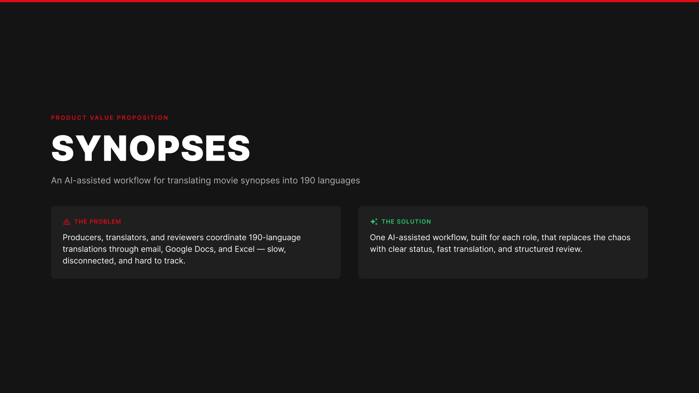
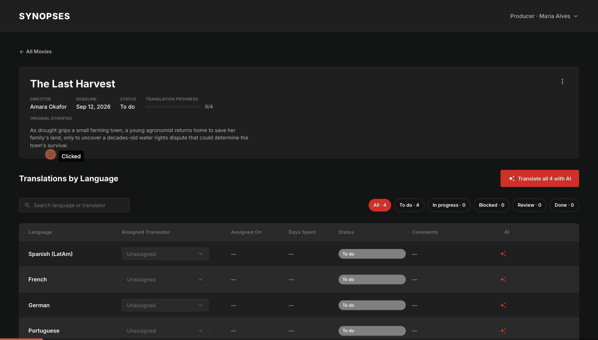

# Synopses



**Live prototype:** [synopsesjz.netlify.app](https://synopsesjz.netlify.app/producer)

**Design file:** [figma.com/design/VCbxdDdbOWFtrQYIYSGp4O/Synopses](https://www.figma.com/design/VCbxdDdbOWFtrQYIYSGp4O/Synopses?node-id=0-1&t=PY4YevcXtJEqvaFM-1)

**Project overview:** [docs/ai-collaboration-brief.md](docs/ai-collaboration-brief.md)

**Synopses** replaces email/Google Docs/Excel for coordinating movie-synopsis translation into up to 190 languages, across three roles — **Producer**, **Translator**, and **Reviewer**.

## Executive summary

### The problem

Coordinating synopsis translation at scale — up to 190 languages per title — over email threads, shared Docs, and Excel trackers breaks down fast:

- No single source of truth for what's translated, in progress, blocked, or ready to ship, per movie and per language
- Task assignment and status updates are manual and easy to lose in inboxes
- Reviewer feedback lives in email/chat instead of attached to the translation it's about, so context gets lost between passes
- No visibility into translator workload, availability, or why work has stalled (absence, an incomplete source synopsis, etc.)
- AI-assisted translation is used ad hoc, with no consistent handoff into human review — output risks going un-routed

### Roles we tackled, and what we built for each

| Role | Problem | Solution |
|---|---|---|
| **Producer** | Needs to create and distribute translation work across many languages and translators, and track it all without chasing status by hand | A single dashboard with status-gated actions (view/update/download/share/delete), per-language or bulk AI translation that auto-routes results to review, and a guided create-and-assign flow |
| **Translator** | Needs one place to see assigned work, translate it (AI, manual, or both), and resolve reviewer feedback without losing context | A unified workspace with source and translation side by side, AI translate/polish available at any point in the flow, threaded reviewer comments with replies, and self-service absence management that automatically re-flags in-progress work as blocked |
| **Reviewer** | Needs to check translations against the source quickly, leave actionable feedback, and get declined work back to the right person without a manual loop | A side-by-side review screen with an AI-assisted quality check, one-click approve, and decline-with-required-comment that automatically reassigns the task to the original translator |

### Demo



*As a Producer: open "The Last Harvest," translate all 4 languages with AI in one click, head back to All Movies, then open "Glass Horizon" and check its actions menu — including Download all translations, available once every language is Done.*

### Impact this prototype demonstrates

As a working prototype rather than a production deployment, "impact" here means what the interaction design proves out, not measured production metrics:

- **Every core flow — create → distribute → access, translate → submit, review → approve/decline — is completable in under 10 clicks**, verified by hand while building this repo
- **Status is never ambiguous**: consistent badges and colors across all three roles, and a `Blocked` state is never shown without a visible reason (incomplete synopsis, absence, or reviewer feedback)
- **AI output is never orphaned**: bulk or per-language AI translation is routed straight to a reviewer, closing the gap between "AI drafted it" and "someone owns getting it approved"
- **Feedback loops close automatically**: a decline carries its comment straight back to the translator's queue, instead of relying on someone to relay it
- **Workload changes propagate on their own**: marking a translator absent immediately reflects across their in-progress work, with no manual reassignment step

This repo is that prototype: every flow above is genuinely stateful and interactive, built directly from the validated Figma designs above.

## Tech stack

- React + TypeScript + Vite
- Tailwind CSS (dark theme, tokens matched to Figma)
- React Router
- Zustand, persisted to `localStorage`

## Getting started

```bash
npm install
npm run dev
```

The app runs at `http://localhost:5173`. There's no real backend or auth — use the role switcher in the header (top right) to jump between the Producer, Translator, and Reviewer personas and demo all three flows from one build.

Other scripts:

```bash
npm run build     # type-check and production build
npm run lint       # Oxlint
npm run preview    # preview the production build locally
```

## What's mocked vs. real

- **AI translate / polish / review-note**: stubbed — a short loading delay, then placeholder generated text. No live LLM call.
- **Google Docs / Excel import** (Create Synopsis): accepts a link or file, but parsing is stubbed with placeholder text.
- **Everything else** — routing, status transitions, translator assignment, comments/replies, absence auto-blocking, reviewer decline → reassignment — is fully wired against real app state and persists to `localStorage` across refreshes.

## Roles at a glance

| Role | Screens | Key actions |
|---|---|---|
| **Producer** | Dashboard, Movie Detail, Create Synopsis | Create/distribute translation tasks, assign translators or trigger AI translation, track progress, download/share completed work |
| **Translator** | My Translations, Translate | Translate with AI and/or manually, manage absence, reply to reviewer comments, submit for review |
| **Reviewer** | My Review Tasks, Review Translation | AI-assisted review, approve or decline (with a required comment) — declines reassign to the original translator |
